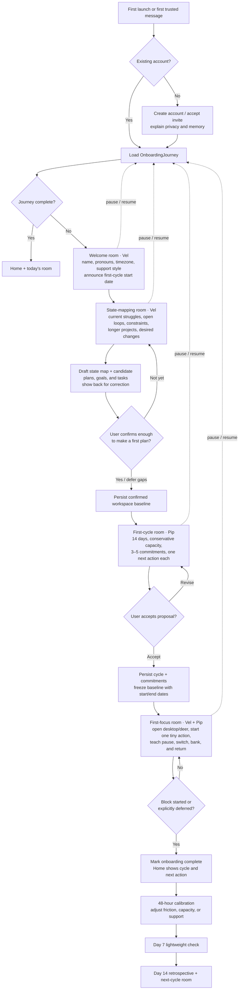

# Initial user startup and onboarding

**Status:** codebase analysis and product proposal — **superseded in
part (2026-08-24):** the proposal half (§2.6–§3, the four-conversation-
rooms flow) is replaced by the app-first design in
[`FIRST_RUN_DESIGN.md`](FIRST_RUN_DESIGN.md); the analysis (§1–§2.5)
still stands as that design's evidence base.

**Date:** 2026-08-17

**Scope:** the first contact through the first useful Chordial cycle

## Executive conclusion

Chordial currently has a warm, well-considered **introduction ritual**, but it
does not yet have a complete **product onboarding journey**.

The current flow can learn the user's name, pronouns, timezone, a broad piece
of personal calibration, and how they want an individual helper represented.
It can then mark that helper as met. It does **not** reliably learn the user's
current struggles, active obligations, longer-term projects, constraints, or
capacity; create a first two-week cycle; teach the focus loop; or persist where
the user is in that larger journey.

The next version should keep the conversational warmth, but put it inside a
deterministic, resumable sequence of guided rooms. The recommended sequence is:

1. **Welcome room** — establish trust, identity, expectations, and an explicit
   first-cycle start date.
2. **State-mapping room** — learn what is hard now, what is already in motion,
   what must not be dropped, and what matters over a longer horizon.
3. **First-cycle room** — turn that map into a small, honest 14-day proposal,
   let the user correct it, and freeze the accepted baseline.
4. **First-focus room** — demonstrate the actual Chordial loop by starting one
   tiny action with the deer present.

The core design principle is: **a deterministic outer journey, with
conversational interiors**. The code should guarantee that the important
ground is covered and that progress can resume; the helpers should decide how
to ask, respond, and make the experience feel human.

> Note on sources: this walkthrough follows executable code as it exists on
> 2026-08-17. Some older design text no longer matches it. In particular,
> `docs/ROOMS_DESIGN.md` says the multi-bot Telegram ensemble is retired, while
> `main.py` and `src/providers/platforms/telegram_bot.py` still implement it.

---

## 1. Walkthrough: how onboarding works in the current codebase

### 1.1 There is no single universal signup door

The first step depends on the surface.

| Surface | What an unknown person experiences |
|---|---|
| Discord DM | Any DM reaches `ChatService`. A `User` and `PlatformIdentity` are created on the first message. |
| Telegram DM, default configuration | The bot is gated. Bare `/start` returns a static stranger message, and ordinary text from an unknown sender does not create a user or call a model. |
| Telegram DM with `TELEGRAM_OPEN_ONBOARDING=true` | Bare `/start` returns a static invitation. On Vel's bot, the first ordinary text message creates the account and starts Vel's introduction. A code-shaped message is always treated as an account-link attempt first. |
| Desktop app | There is no new-account flow. The app opens on a link-code screen and can only attach to a user that already exists. The code normally comes from asking Chordial in a private chat, or from the dev script. |

Relevant code:

- [`DiscordInterface.handle_incoming_message`](../src/providers/platforms/discord_bot.py)
- [`TelegramInterface._on_start` and `_on_message`](../src/providers/platforms/telegram_bot.py)
- [`UserManager.get_or_create_user`](../src/managers/user_manager.py)
- [`LinkScreen`](../app/src/components/LinkScreen.tsx)
- [`link_device`](../src/web/device_auth.py)

This means “starting Chordial” is currently two different things:

- creating or linking an identity through chat; and
- linking a desktop device and entering the application.

They are connected operationally, but they are not presented as one guided
journey.

In a multi-bot Telegram deployment, the open-onboarding flag applies to every
helper interface. If an unknown person starts by messaging a specialist bot,
the first message can create a user but does not start that specialist's
introduction: only an already-`introducing` specialist gets introduction
routing. This is another reason the product needs one canonical front door.

### 1.2 Desktop startup is authentication-first, not onboarding-first

On launch, `App` reads a bearer token from webview `localStorage`.

- No token: show `LinkScreen`.
- Valid token: fetch the council and render `Home`.
- A 401 anywhere: clear the token and return to `LinkScreen`.

After a successful device-code redemption, the token and device ID are saved
locally and the user goes directly to Home. Home fetches:

- today's task buckets;
- the active cycle projection;
- the archive of closed daily rooms; and
- the council roster.

No endpoint tells the app that onboarding is underway. There is no onboarding
route, progress indicator, next required step, or automatic opening message.
For a fresh account, the likely first screen is therefore:

- an empty task area saying “nothing on the list — a quiet day is allowed”;
- no cycle panel at all, because `CyclePanel` returns `null` when no active
  cycle exists;
- a button to enter today's room; and
- a council rail in which Vel appears active even if no `HelperState` row
  exists.

The introduction does not start when the desktop is linked, Home is opened, or
the room is opened. It starts only after the user types their first room
message.

Relevant code:

- [`App`](../app/src/App.tsx)
- [`Home`](../app/src/components/Home.tsx)
- [`CyclePanel`](../app/src/components/CyclePanel.tsx)
- [`PresenceRail`](../app/src/components/PresenceRail.tsx)
- [`WebServer._api_council`](../src/web/server.py)

### 1.3 The first real message creates the conversational introduction state

Every incoming message reaches `ChatService.process_message`.

1. The platform identity is resolved or created.
2. The user's name, timezone, and pronouns are loaded.
3. The addressed helper's `HelperState` is loaded. A missing row is treated as
   `not_met`.
4. For the chair, Vel, the turn is classified as `introduction` when:
   - Vel is already `introducing`; or
   - Vel is not active and the user has no preferred name.
5. If necessary, Vel's state is persisted as `introducing`.
6. A local-date daily room is lazily created and used as the conversation
   stream.
7. Although the desktop room normally behaves as a shared council room, an
   introduction is deliberately changed to DM scope with Vel as its audience.

That last point keeps identity conversation out of shared helper context and
out of the shared room summary. The user's own desktop transcript still reads
all message rows in the room, so the conversation remains visible to them.

There are two backward-compatibility exceptions:

- An `active` Vel means the introduction is complete even if
  `preferred_name` is still null.
- A pre-v3 user with a preferred name and no Vel state skips the introduction.

Relevant code:

- [`ChatService.process_message` and `_still_introducing`](../src/services/chat_service.py)
- [`HelperStateManager`](../src/managers/helper_state_manager.py)
- [`RoomStore.current_room`](../src/services/rooms.py)
- [`WebServer._api_room_send`](../src/web/server.py)

### 1.4 The orchestrator routes introduction turns directly to one helper

`ChordialDirector` treats `kind="introduction"` as a deterministic path:
the addressed helper is the only speaker. The normal shared-room speaking
decision is bypassed.

`ChordialContext` maps the stimulus to an introduction briefing and omits the
workspace agenda. This keeps the first meeting light, but it also means the
helper is not shown existing tasks, plans, cycles, or overdue work during the
introduction.

The current daily room's visible event window becomes model history. An
ambient summary of the most recently closed room may also be supplied.

Relevant code:

- [`ChordialDirector.direct`](../src/services/orchestration.py)
- [`ChordialContext.enrich`](../src/services/orchestration.py)
- [`SqlEventStore`](../src/managers/event_store_adapter.py)

### 1.5 The introduction itself is a model-driven ritual

There is intentionally no question-by-question onboarding state machine.
`PromptService.build_introduction_request` gives the helper a shared set of
instructions plus the helper's authored `intro_block` and one signature
question.

The shared instructions ask the helper to move briskly through:

1. Name and pronouns, saved immediately with `set_preference`.
2. Approximate location/timezone, also saved with `set_preference`.
3. One helper-specific signature question, with at most one follow-up; useful
   facts are saved as shared memories.
4. An optional offer to reshape the helper's name, species, gender, or vibe.
5. A mandatory `complete_introduction` tool call.

Vel's signature prompt is broad and personal: who the user really is, what
makes them happy, and how they would like work, life, friendships, or their body
to be in an ideal world. Other helpers ask one question inside their lane—for
example, Pip asks what a genuinely good “got-things-done” day feels like.

The prompt also instructs every response during the ritual to end with forward
motion. Tangents are allowed; the model is expected to bring the conversation
back and finish the ritual later.

Relevant code:

- [`_INTRO_SHARED_GUIDANCE`](../src/services/prompt_service.py)
- [`PromptService.build_introduction_request`](../src/services/prompt_service.py)
- [`vel.yaml`](../src/personas/vel.yaml)
- [`pip.yaml`](../src/personas/pip.yaml)

### 1.6 Completion is per helper, not for Chordial as a product

`complete_introduction` atomically moves one `(user, helper)` relationship to:

- `active`, optionally with a chosen `persona_name` and `persona_form`; or
- `declined`.

If the helper was reshaped, the prompt also asks the model to save that
identity as a private core memory visible only to that helper. Facts about the
user are shared memories.

Until the tool is successfully called, every subsequent message to that helper
continues to be classified as `introduction`. There is no persisted stage
inside the ritual beyond `introducing`, and no code-side completion check for
name, timezone, pronouns, or signature calibration.

Once Vel becomes active, the next message is an ordinary conversation turn.
Nothing else automatically happens: no task is created, no project is mapped,
no cycle is scheduled, and no focus block is proposed.

Relevant code:

- [`complete_introduction`](../src/services/tools/intro_tools.py)
- [`HelperStateManager.complete_introduction`](../src/managers/helper_state_manager.py)

### 1.7 Meeting the rest of the council is optional and Telegram-shaped

At the end of an introduction, the helper is instructed to call
`list_available_guides`. It lists deployed helpers who are neither active nor
declined. When a configured Telegram bot username exists, it includes a
`t.me/<bot>?start=meet` deep link.

For a known Telegram user, opening that link:

1. sets that helper to `introducing`;
2. starts a cold introduction turn in the helper's DM;
3. runs the same name/timezone/signature/representation framework, although
   existing profile fields should already be present; and
4. ends in that helper becoming active or declined.

There is no equivalent clickable meeting action in the desktop council rail.
Unmet helpers are displayed but the rail is informational only. If Telegram
usernames are not configured, `list_available_guides` can name a helper but
cannot provide an actionable link.

Relevant code:

- [`list_available_guides`](../src/services/tools/intro_tools.py)
- [`ChatService.begin_introduction`](../src/services/chat_service.py)
- [`TelegramInterface._on_start`](../src/providers/platforms/telegram_bot.py)
- [`PresenceRail`](../app/src/components/PresenceRail.tsx)

### 1.8 What is actually persisted by the end

If the model follows every instruction, the current introduction can leave:

- `User.preferred_name`;
- `User.pronouns`;
- `User.timezone`;
- one or more shared freeform memories about the user;
- a per-helper relationship status and introduction timestamp;
- optional per-helper name/form overrides and private identity memory; and
- the conversation and tool actions in the daily room's event log.

It does not necessarily leave:

- an explicit statement of the user's current struggles;
- an inventory of open loops or near-term obligations;
- active plans, goals, or tasks;
- a capacity or availability estimate;
- a selected first-cycle start date;
- a first cycle, commitments, or frozen baseline;
- a demonstrated focus session;
- a product-level onboarding status; or
- a durable record of which intake areas were covered and confirmed.

---

## 2. Analysis: gaps and opportunities

### 2.1 The central mismatch: helper introduction versus product activation

The code currently answers: **“Has this person met this helper?”**

The product needs to additionally answer: **“Does Chordial know enough to
make a responsible first plan, and has the person experienced the loop that
the product is built around?”**

Those are different states. Treating the first as the second makes the system
feel warm but under-informed precisely when its first recommendations matter
most.

The best next step is not to replace the current introduction. It is to make
it the first room in a larger activation journey.

### 2.2 Critical gaps

#### A. No product-level onboarding state

`HelperState.status` is per relationship and has only
`not_met → introducing → active|declined`. It cannot represent “we know your
identity, but have not mapped your work,” “cycle draft waiting for approval,”
or “first focus block not tried.”

Consequences:

- the UI cannot render a reliable next step;
- the server cannot resume at a known stage;
- a model tool-call omission can strand the user indefinitely;
- completion cannot be measured or versioned; and
- later onboarding improvements cannot be selectively applied to existing
  users.

**Opportunity:** add a separate, versioned `OnboardingJourney` owned by the
product, not by any helper.

#### B. No guaranteed operating baseline

Vel's signature question may uncover goals or hopes, but the prompt does not
guarantee coverage of:

- what feels hardest right now;
- what is urgent or already late;
- what repeatedly fails at the moment of starting;
- current responsibilities and immovable constraints;
- ongoing projects and longer-term ambitions;
- available time/energy over the next two weeks; or
- what kind of help is welcome versus irritating.

Freeform memories are valuable relationship context, but they do not prove
that the minimum planning inputs exist.

**Opportunity:** create a resumable baseline room with a coverage contract and
a visible, user-confirmed state map. The conversation can remain freeform;
coverage should be deterministic.

#### C. No bridge into the first two-week cycle

The data model already supports cycles, commitments, capacity, next actions,
an immutable baseline, and explicit scope changes. None of it is invoked by
onboarding. A new user's Home silently hides the cycle panel when no cycle
exists.

This is the largest missed opportunity in the current flow: the product's
central structure is absent from the user's first experience.

**Opportunity:** make a proposed first cycle the required artifact of
onboarding. Chordial chooses a sensible default, explains it, asks for a
correction rather than asking the user to design a system, and then freezes the
accepted baseline.

#### D. The first experience is a blank canvas

The desktop opens to Home, Home may be empty, and the room waits for the user
to say something. The user has to initiate the initiation tool.

For an ADHD-oriented product, this is especially costly. A person arriving
because starting is difficult is immediately asked to decide where to click
and what to say.

**Opportunity:** when onboarding is incomplete, Home should become a guided
arrival screen with one primary action: **continue setup**. Entering the first
room should produce the helper's opening line without requiring a sacrificial
“hi.”

#### E. Completion depends on model behavior

The prose prompt says “always” call `complete_introduction`, but code cannot
verify that the intermediate ground was covered. There is also no bounded
recovery policy when the user stops answering, changes topic, or the model
fails before the final tool call.

**Opportunity:** let the model conduct the conversation, but let server-side
commands mark explicit outputs as collected or deferred. Transition rooms only
when their required output contract is satisfied or the user explicitly
chooses to skip.

### 2.3 Correctness and continuity risks in the current implementation

#### Split-brain definitions of “onboarded”

Chat routing treats Vel's `HelperState.status == active` as completion.
Scheduled outreach uses `User.preferred_name is not null` through both
`get_scheduled_users` and `needs_onboarding`.

Because the introduction asks the model to save the name near the beginning,
scheduled outreach can become eligible before the introduction is actually
complete. Conversely, an active Vel with no stored name is treated as finished
by chat but unfinished by the scheduler.

**Recommendation:** all onboarding gates should read one product-level state.

#### Multi-day introductions do not retain their private conversational detail

Actual introduction messages are DM-scoped. Room summaries deliberately
exclude all DM-scoped events so one helper's private context never hydrates
another helper. On a local-date rollover, the new daily room has no transcript
from the prior room and receives only that shared summary.

As a result, `status=introducing` survives, but the actual private answers from
the prior day do not hydrate the next day's model context. The helper knows it
is still introducing but may not know where the conversation left off. The
existing multi-day introduction test uses a group-scoped fixture, so it does
not exercise the real privacy shape.

**Recommendation:** onboarding rooms should be durable across days, or have a
helper-private onboarding summary/artifact that can safely resume them.

#### UI and server state disagree about whether Vel has been met

The council API renders an implicit `not_met` chair as `active` so the front
door always appears present. The chat router still treats that same state as a
new introduction when the name is absent. This makes the UI unable to explain
the real relationship state.

**Recommendation:** distinguish `available` from `met/active` in the API.

### 2.4 Experience gaps

- **No declared promise or time horizon.** The user is not told what will
  happen, how long setup takes, or when the first cycle begins.
- **No progress or resumption affordance.** The only sign of unfinished work is
  that later messages continue receiving introduction prompts.
- **No immediate product proof.** The user does not necessarily see a task
  become a next action, start a focus block, bank time, or watch cycle progress
  move.
- **Helper introductions arrive too early relative to value.** Seven charming
  relationship rituals can become onboarding surface area before the user has
  completed the core loop. The rest of the council is better as progressive
  disclosure after a useful baseline exists.
- **Desktop helper discovery is passive.** Unmet helpers are visible but not
  actionable.
- **Self-serve access is inconsistent.** Discord trusts first contact,
  Telegram is gated by default, and desktop cannot create an account.
- **No explicit consent/account lifecycle step.** The current path has no
  terms/privacy acknowledgement or clear explanation of what is remembered.
  `docs/MULTI_USER_SPEC.md` already identifies this as a launch requirement.
- **No funnel instrumentation.** There is no durable event model for arrival,
  room started, baseline confirmed, cycle frozen, first focus started, or
  first focus completed.

### 2.5 Existing assets make a strong next version unusually achievable

The needed work is mostly composition, not reinvention:

- `Room.room_type` is already extensible beyond `daily` and `legacy`.
- `Plan`, `Goal`, `Task`, `Cycle`, and `Commitment` already provide the
  canonical artifacts an intake should produce.
- The cycle spine already supports capacity, next actions, baseline freezing,
  progress, and explicit scope changes.
- The desktop already has a cycle read model and focus-start affordance.
- Helpers already have specialized voices and tool permissions.
- DM scope, per-helper memory privacy, and the event log already provide a
  strong privacy foundation.

The product opportunity is to connect these primitives into one opinionated
first-run contract.

### 2.6 Recommended product contract

The opening should be explicit and confident:

> hey — welcome in. we’re going to start your first two-week cycle on
> **{Tuesday, August 18}**. i’ll guide you through every step: first i’ll learn
> what life actually looks like right now, then we’ll make a small plan, and
> then we’ll start one real thing together. you do not need to organize any of
> this for me. i’m going to be fairly opinionated for the first cycle; if you
> suspect another system would work better, humor me for these two weeks and
> we’ll adjust from evidence afterward. nothing is set in stone, and you can
> change or skip anything as we go.

That framing does four useful things:

- removes the blank-page burden;
- sets a concrete date and scope;
- promises accompaniment rather than homework; and
- makes the structure an experiment, not a judgment.

The confidence should never hide control. “Humor me” works only when **change,
skip, pause, and explain why** remain visible options.

### 2.7 What the structured baseline should contain

The onboarding system should be able to answer these questions before it
proposes a cycle:

| Area | Minimum useful output | Natural destination |
|---|---|---|
| Immediate pressure | What feels most pressing or painful now? | Baseline snapshot + observations |
| Open loops | What must happen soon, including overdue or avoided work? | Tasks |
| Longer efforts | What projects or life changes matter beyond this week? | Plans and goals |
| Constraints | Hard dates, caregiving, work hours, health/energy limits, travel | Baseline snapshot + task dates |
| Friction | Where does work break: choosing, starting, staying, switching, finishing, remembering? | Structured working profile |
| Capacity | A deliberately conservative estimate for the next 14 days | Cycle capacity |
| Support style | Quiet/loud, direct/gentle, reminder tolerance, body-doubling preference | User preferences |
| First action | One tiny, unambiguous thing that can be started now | Commitment `next_action` + task |

The state map should be shown back to the user for correction. Helpers may
infer and draft; they should not silently convert vulnerable conversation into
commitments.

### 2.8 Suggested persistence boundary

Keep helper relationships and product onboarding separate.

At minimum, add a versioned journey record with fields equivalent to:

```text
OnboardingJourney
  user_uuid
  version
  status                 # not_started | in_progress | complete | paused
  current_step           # welcome | state_map | cycle_plan | first_focus
  current_room_uuid
  proposed_cycle_start
  first_cycle_id
  started_at
  completed_at
```

Add a durable `IntakeSnapshot` or equivalent structured artifact for baseline
facts that do not naturally belong to a task, plan, goal, or preference. It
should preserve:

- what the user explicitly said versus what Chordial inferred;
- whether the user confirmed it;
- collection status per coverage area (`known`, `deferred`, `not_applicable`);
  and
- the onboarding version that produced it.

Do not make the transcript or a bag of memories the only source of truth for
whether the baseline is complete.

### 2.9 Completion criteria for the next version

“Onboarded” should mean all of the following, unless explicitly deferred by
the user:

- identity and timezone are usable;
- the user understands what Chordial remembers and controls;
- current pressure, open loops, longer projects, constraints, friction, and
  support style have been mapped or consciously skipped;
- a 14-day cycle has a stated start/end date, conservative capacity, a short
  list of commitments, and one next action per active commitment;
- the user has reviewed the proposal;
- the accepted cycle baseline is frozen; and
- the user has started or explicitly deferred the first focus block.

Helper introductions beyond Vel and Pip should not block this status.

---

## 3. Proposed next-version onboarding flow



### Room behavior

#### Welcome room

Purpose: make arrival safe, concrete, and finite.

- Opens proactively; the user does not have to type “hi.”
- Says there will be four short rooms and shows progress.
- Proposes a first-cycle date. Recommended default: the next local day, ending
  13 days later; “start today” remains one tap away.
- Collects identity, timezone, memory/privacy acknowledgement, and broad
  support style.
- Preserves the current optional “make Vel yours” moment, but does not let it
  consume the main activation path.

Artifact: usable profile + onboarding journey advanced to `state_map`.

#### State-mapping room

Purpose: understand the user's real starting state without making them build a
taxonomy.

- Starts with a low-friction brain dump.
- Vel asks one question at a time and maintains a visible “what I heard” map.
- Existing workspace data, when present, is loaded rather than deliberately
  hidden.
- Chordial proposes tasks/plans/goals and asks for corrections before
  activating them.
- Missing areas can be deferred explicitly instead of trapping the user in
  setup.

Artifact: confirmed intake snapshot plus initial workspace entities.

#### First-cycle room

Purpose: convert the map into a deliberately small experiment.

- Pip proposes a cycle rather than asking the user to invent one.
- Pip's arrival is a short, contextual introduction to the productivity lane;
  it does not require a separate character-customization ritual before useful
  work can begin.
- Capacity is conservative; it should visibly leave slack.
- The first cycle should normally contain 3–5 commitments, not the full open
  loop inventory.
- Every commitment receives one concrete next action.
- The cycle is shown as a reviewable artifact before the baseline is frozen.
- After acceptance, changes remain welcome but become explicit scope changes,
  using the machinery that already exists.

Artifact: active 14-day cycle + commitments + frozen baseline.

#### First-focus room

Purpose: prove the product through action, not explanation.

- Select the smallest useful next action.
- Link/open the desktop if it is not already present.
- Start a short block with the deer.
- Teach only the mechanics the user needs now: time banks, pausing is safe,
  switching is safe, and returning counts.
- Let “not now” complete the room with a scheduled return point instead of
  treating it as failure.

Artifact: first focus event or an explicit deferral; onboarding marked
complete.

### After onboarding

The first cycle is a calibration cycle, not a test the user can fail.

- **48 hours:** ask whether the plan feels too large, too vague, or too noisy.
- **Day 7:** make one lightweight balance adjustment if evidence supports it.
- **Day 14:** review planned versus actual work, name patterns without blame,
  and propose the second cycle from evidence.
- Introduce additional helpers progressively when a live need enters their
  lane. Meeting the whole council is optional and should never block getting
  started.

This realizes the intended arc: Chordial begins highly structured and present,
then earns the right to become quieter as it learns what actually helps this
person.
